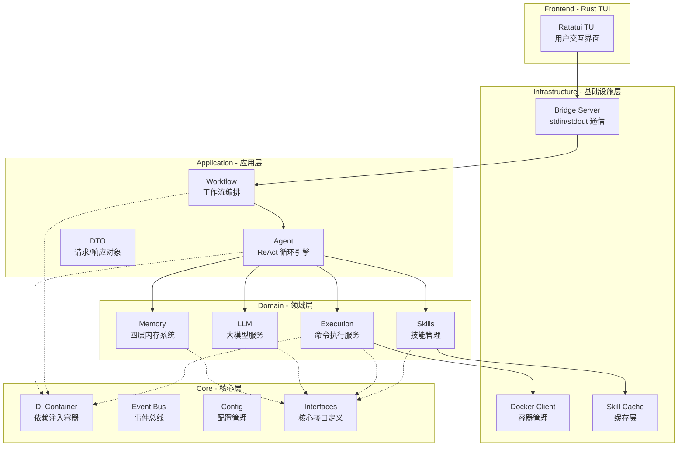
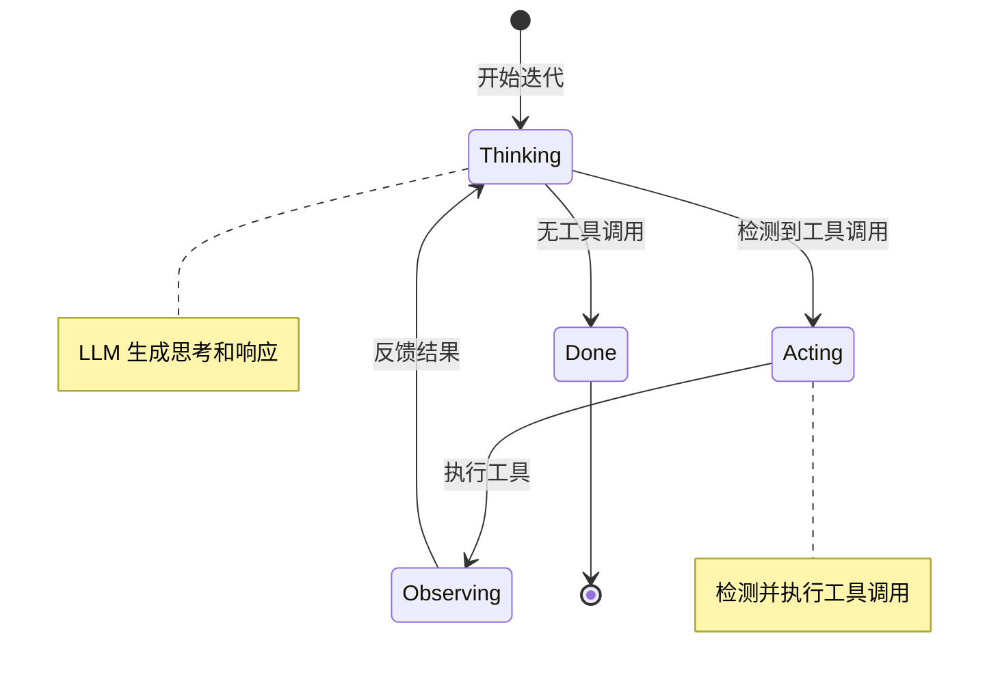
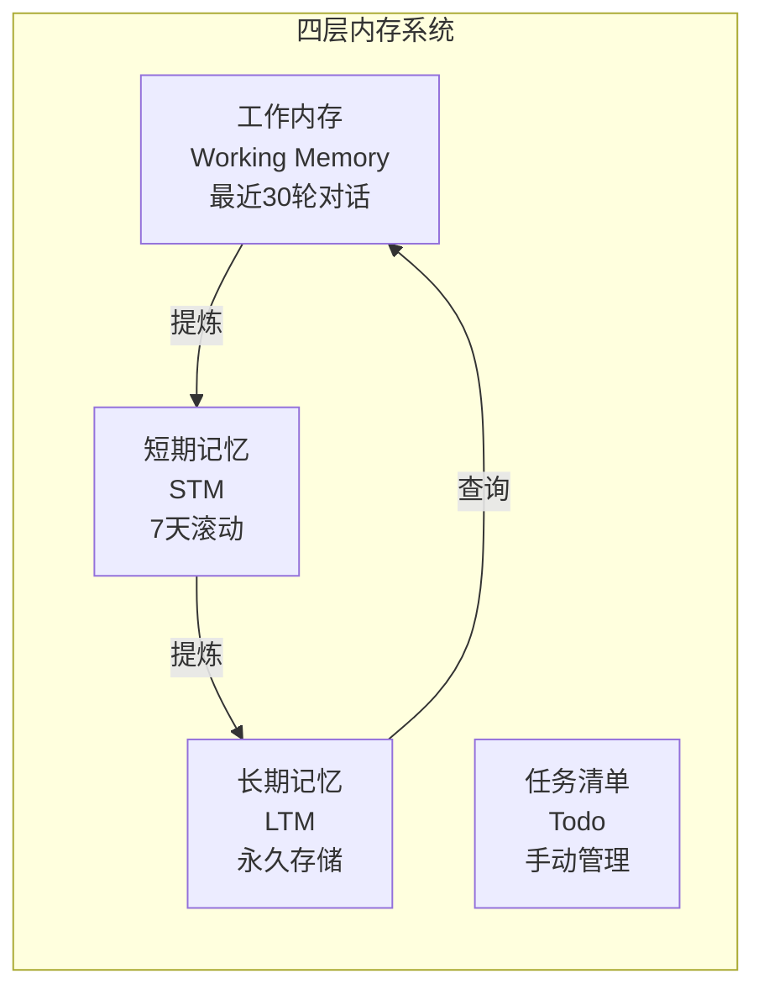
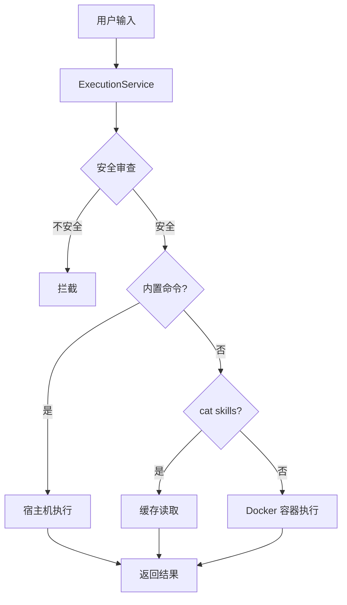
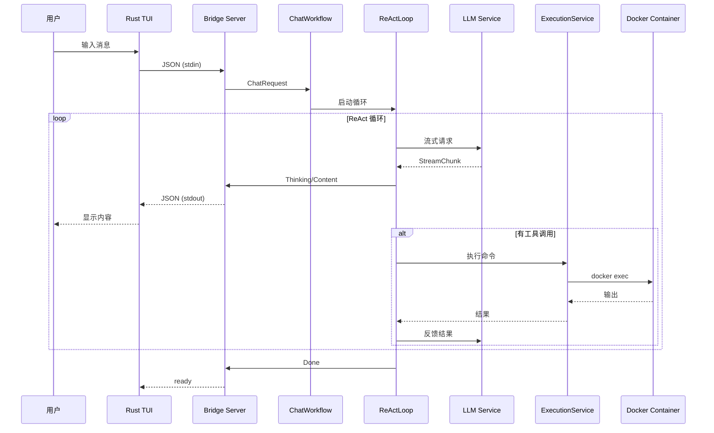
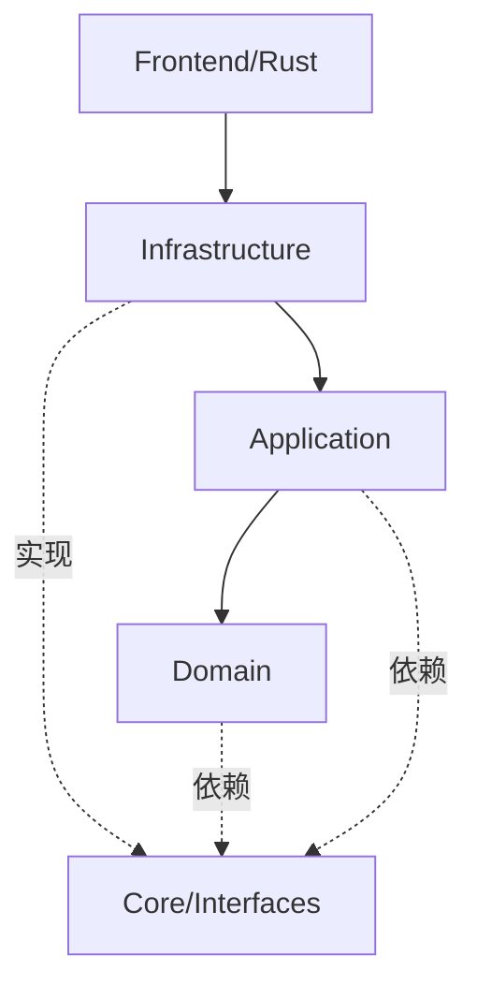

# Alice 架构文档

> 本文档描述 Alice-Single 重构后的分层架构设计。

## 目录

- [概述](#概述)
- [分层架构](#分层架构)
- [核心设计模式](#核心设计模式)
- [数据流](#数据流)
- [模块依赖](#模块依赖)

---

## 概述

Alice 采用 **DDD（领域驱动设计）+ 分层架构 + 依赖注入** 的设计模式，将系统划分为清晰的层次结构。



---

## 分层架构

### 1. 前端层 (Frontend - Rust)

**位置**: `src/main.rs`

**职责**:
- 用户交互界面渲染（Ratatui）
- 键盘/鼠标事件处理
- 与 Python 后端的 JSON Lines 通信

**核心组件**:
```rust
// 通信协议消息
enum BridgeMessage {
    Status { content: String },
    Thinking { content: String },
    Content { content: String },
    Tokens { total, prompt, completion },
    Error { content: String },
}

// 应用状态
struct App {
    input: String,
    messages: Vec<Message>,
    status: AgentStatus,
    child_stdin: Option<ChildStdinWrapper>,
    // ...
}
```

---

### 2. 基础设施层 (Infrastructure)

**位置**: `backend/alice/infrastructure/`

**职责**: 提供技术基础设施实现，不包含业务逻辑

#### 2.1 Bridge 通信模块

```
infrastructure/bridge/
├── server.py              # 桥接服务器主入口
├── stream_manager.py      # 流式输出管理器
├── protocol/
│   ├── messages.py        # 协议消息定义
│   └── codec.py          # JSON 编解码
├── transport/
│   ├── transport_trait.py # 传输层抽象接口
│   └── stdio_transport.py # stdin/stdout 实现
└── event_handlers/
    ├── message_handler.py # 消息事件处理
    └── interrupt_handler.py # 中断事件处理
```

**协议定义**:
```python
# Python -> Rust 消息类型
class MessageType(str, Enum):
    STATUS = "status"      # 状态更新
    THINKING = "thinking"  # 思考内容（侧边栏）
    CONTENT = "content"    # 正文内容（主聊天区）
    TOKENS = "tokens"      # Token 统计
    ERROR = "error"        # 错误消息
    INTERRUPT = "interrupt" # 中断信号

# Rust -> Python 请求
@dataclass
class FrontendRequest:
    input: str  # 用户输入内容
```

#### 2.2 Docker 管理模块

```
infrastructure/docker/
├── client.py           # Docker API 客户端封装
├── container_manager.py # 容器生命周期管理
├── image_builder.py    # 镜像构建
└── config.py          # Docker 配置
```

#### 2.3 缓存模块

```
infrastructure/cache/
```

技能内容缓存，避免频繁的 docker exec 调用。

---

### 3. 应用层 (Application)

**位置**: `backend/alice/application/`

**职责**: 编排领域服务，处理应用级业务逻辑

#### 3.1 目录结构

```
application/
├── agent/
│   ├── agent.py         # Agent 主控制器
│   └── react_loop.py    # ReAct 循环引擎
├── workflow/
│   ├── base_workflow.py # 工作流基类
│   ├── chat_workflow.py # 聊天工作流
│   └── tool_workflow.py # 工具执行工作流
├── services/
│   ├── orchestration_service.py  # 编排服务
│   └── lifecycle_service.py      # 生命周期服务
└── dto/
    ├── requests.py      # 请求 DTO
    └── responses.py     # 响应 DTO
```

#### 3.2 ReAct 循环引擎

核心推理-行动循环逻辑：

```python
class ReActLoop:
    """ReAct (Reasoning + Acting) 循环引擎"""

    def __init__(self, config: ReActConfig):
        self.config = config
        self._state = ReActState()

    def should_continue(self) -> bool:
        """判断是否继续循环"""
        return not self._state.interrupted and \
               self._state.iteration < self.config.max_iterations

    def start_iteration(self) -> None:
        """开始新迭代"""
        self._state.iteration += 1
        self._state.phase = "thinking"
```

**循环流程**:


#### 3.3 DTO 定义

**请求类型**:
```python
class ApplicationRequest:
    ChatRequest         # 聊天请求
    InterruptRequest    # 中断请求
    StatusRequest       # 状态请求
    RefreshRequest      # 刷新请求
```

**响应类型**:
```python
class ApplicationResponse:
    ContentResponse        # 正文响应
    ThinkingResponse       # 思考响应
    StatusResponse         # 状态响应
    ErrorResponse          # 错误响应
    TokensResponse         # Token 统计
    ExecutingToolResponse  # 工具执行通知
    DoneResponse           # 完成信号
```

---

### 4. 领域层 (Domain)

**位置**: `backend/alice/domain/`

**职责**: 核心业务逻辑，领域模型，与基础设施无关

#### 4.1 内存域 (Memory)

```
domain/memory/
├── stores/
│   ├── base.py          # 存储基类
│   ├── working_store.py # 工作内存（30轮对话）
│   ├── stm_store.py     # 短期记忆（7天滚动）
│   └── ltm_store.py     # 长期记忆（永久）
├── services/
│   ├── memory_manager.py # 内存管理器
│   └── distiller.py     # 记忆提炼服务
├── models/
│   ├── memory_entry.py  # 记忆条目
│   └── round_entry.py   # 对话轮次
└── repository/
    └── file_repository.py # 文件仓储实现
```

**四层内存架构**:


#### 4.2 LLM 域

```
domain/llm/
├── providers/
│   ├── base.py          # Provider 接口
│   └── openai_provider.py # OpenAI 兼容实现
├── services/
│   ├── chat_service.py  # 聊天服务
│   └── stream_service.py # 流式处理服务
├── parsers/
│   └── stream_parser.py # 流式响应解析
└── models/
    ├── message.py       # 消息模型
    ├── response.py      # 响应模型
    └── stream_chunk.py  # 流式块模型
```

**LLM Provider 接口**:
```python
class LLMProvider(Protocol):
    """LLM 提供商接口"""

    def chat(self, messages: list[ChatMessage]) -> ChatResponse: ...
    async def achat(self, messages: list[ChatMessage]) -> ChatResponse: ...
    def stream_chat(self, messages: list[ChatMessage]) -> iter[StreamChunk]: ...
    def count_tokens(self, messages: list[ChatMessage]) -> int: ...
```

#### 4.3 执行域 (Execution)

```
domain/execution/
├── executors/
│   ├── base.py          # 执行器基类
│   └── docker_executor.py # Docker 执行器
├── services/
│   ├── execution_service.py # 执行服务（统一入口）
│   └── security_service.py  # 安全审查服务
├── builtin/
│   ├── memory_command.py   # memory 内置命令
│   ├── todo_command.py     # todo 内置命令
│   └── toolkit_command.py  # toolkit 内置命令
└── models/
    ├── command.py       # 命令模型
    ├── execution_result.py # 执行结果
    └── security_rule.py # 安全规则
```

**内置命令拦截流程**:


#### 4.4 技能域 (Skills)

```
domain/skills/
├── loaders/
│   ├── base.py          # 加载器基类
│   ├── directory_loader.py # 目录扫描
│   └── cache_loader.py  # 缓存加载器
├── services/
│   ├── skill_registry.py # 技能注册表
│   └── skill_cache.py   # 技能缓存
├── models/
│   ├── skill.py         # 技能模型
│   └── skill_metadata.py # 元数据
└── repository/
    └── file_repository.py # 文件仓储
```

**技能 SKILL.md 格式**:
```yaml
---
name: skill-name
description: 技能描述
license: MIT
allowed-tools: [...]
metadata: {...}
---
# Markdown 内容...
```

---

### 5. 核心层 (Core)

**位置**: `backend/alice/core/`

**职责**: 横切关注点，基础设施支撑

#### 5.1 依赖注入容器

```python
class Container:
    """依赖注入容器"""

    def register_singleton(self, interface, implementation): ...
    def register_factory(self, interface, factory): ...
    def register_transient(self, interface, implementation): ...
    def get(self, interface) -> T: ...
```

#### 5.2 事件总线

```python
class EventBus:
    """事件总线"""

    def subscribe(self, event_type, handler): ...
    def publish(self, event): ...
    async def async_publish(self, event): ...
```

#### 5.3 配置管理

```python
@dataclass
class Settings:
    llm: LLMConfig
    memory: MemoryConfig
    docker: DockerConfig
    logging: LoggingConfig
    bridge: BridgeConfig
    security: SecurityConfig
```

#### 5.4 核心接口

```
core/interfaces/
├── llm_provider.py       # LLM 接口
├── memory_store.py       # 内存存储接口
├── command_executor.py   # 命令执行接口
└── skill_loader.py       # 技能加载接口
```

---

## 核心设计模式

### 1. 依赖注入 (DI)

使用 `Container` 管理服务生命周期：

```python
container = Container()
container.register_singleton(IMemoryStore, MemoryManager)
container.register_factory(LLMProvider, lambda: OpenAIProvider())

memory = container.get(IMemoryStore)
```

### 2. 仓储模式 (Repository)

领域层通过仓储抽象数据访问：

```python
class MemoryRepository(ABC):
    @abstractmethod
    def save(self, entry: MemoryEntry) -> None: ...

    @abstractmethod
    def find_by_date(self, date: datetime) -> list[MemoryEntry]: ...
```

### 3. 策略模式 (Strategy)

LLM Provider 可通过策略模式替换：

```python
# 使用 OpenAI
container.register_singleton(LLMProvider, OpenAIProvider)

# 或使用其他兼容实现
container.register_singleton(LLMProvider, QwenProvider)
```

### 4. 观察者模式 (Observer)

事件总线实现发布-订阅：

```python
event_bus.subscribe(StatusChanged, handler)
event_bus.publish(StatusChanged(status="thinking"))
```

### 5. 工作流模式 (Workflow)

将复杂流程封装为工作流：

```python
class ChatWorkflow(BaseWorkflow):
    def execute(self, request: ChatRequest) -> Iterator[ApplicationResponse]:
        # 1. 加载上下文
        # 2. ReAct 循环
        # 3. 返回结果
        ...
```

---

## 数据流

### 完整请求处理流程



### Bridge 通信协议

**消息格式**: JSON Lines (每行一个 JSON 对象)

```json
// Python -> Rust: 状态更新
{"type": "status", "content": "thinking"}

// Python -> Rust: 思考内容
{"type": "thinking", "content": "正在分析..."}

// Python -> Rust: 正文内容
{"type": "content", "content": "根据您的要求..."}

// Python -> Rust: Token 统计
{"type": "tokens", "total": 1234, "prompt": 800, "completion": 434}

// Python -> Rust: 错误
{"type": "error", "content": "API 调用失败", "code": "API_ERROR"}

// Rust -> Python: 用户输入 (原始字符串)
用户输入的消息内容

// Rust -> Python: 中断信号
__INTERRUPT__
```

---

## 模块依赖

### 依赖规则

1. **上层依赖下层**: Frontend → Application → Domain ← Infrastructure
2. **Domain 不依赖任何层**: 完全独立，只依赖抽象接口
3. **Infrastructure 实现 Domain 接口**: 依赖倒置
4. **Core 被所有层依赖**: 横切关注点

### 依赖图



### 导入规则

| 层级 | 可以导入 | 禁止导入 |
|------|----------|----------|
| Frontend | 无 (仅 JSON 通信) | 所有 Python 模块 |
| Infrastructure | Core, Domain (接口) | Application, Frontend |
| Application | Domain, Core | Infrastructure (实现) |
| Domain | Core (接口) | Application, Infrastructure, Frontend |
| Core | 无 | 所有业务层 |

---

## 扩展点

### 1. 添加新的 LLM Provider

```python
from backend.alice.core.interfaces.llm_provider import LLMProvider

class CustomProvider:
    def chat(self, messages): ...
    def stream_chat(self, messages): ...

# 注册
container.register_singleton(LLMProvider, CustomProvider)
```

### 2. 添加新的命令执行器

```python
from backend.alice.domain.execution.executors.base import BaseExecutor

class CustomExecutor(BaseExecutor):
    def execute(self, command, is_python_code=False): ...
    def validate(self, command): ...
```

### 3. 添加新的内存存储

```python
from backend.alice.core.interfaces.memory_store import MemoryStore

class CustomMemoryStore(MemoryStore):
    def add(self, entry): ...
    def get_content_text(self): ...
```

### 4. 添加新的技能

在 `skills/` 目录下创建：

```
skills/my-skill/
├── SKILL.md          # 技能元数据
├── script.py         # 脚本文件
└── requirements.txt  # 依赖（可选）
```

然后执行 `toolkit refresh`。
