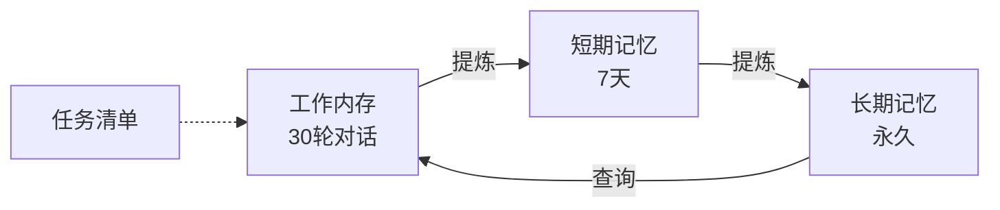
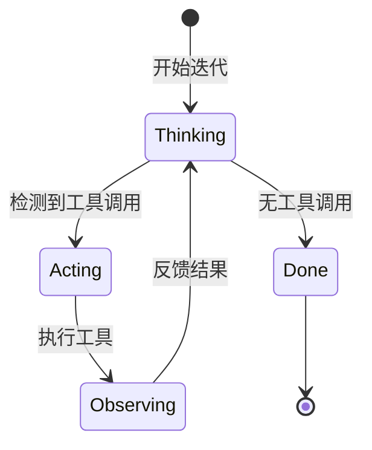

# Alice Agent 技术文档

> **⚠️ 免责声明**：本项目的所有代码均由 AI 生成。使用者在运行、部署或集成前，必须自行评估潜在的安全风险、逻辑缺陷及运行成本。作者不对因使用本项目而导致的任何损失负责。
>
> **💡 特别提示**：本项目包含特定的 **人格设定 (`prompts/alice.md`)** 及 **交互记忆记录 (`memory/`)**。相关文件会记录对话历史。如果您介意此类信息留存，请按需自行编辑或删除相关目录下的文件。

Alice 是一个基于 **ReAct 模式** 的智能体框架，采用 **DDD (领域驱动设计)** + **分层架构** + **依赖注入** 的设计模式。

---

## 效果展示


---

## 项目状态 / Project Status

Alice-Single 正在进行**架构重构**，目标是优化代码结构、提升性能与扩展性。
文档将随重构进度同步更新。

Alice-Single is currently undergoing **architectural refactoring** to improve code structure,
performance, and extensibility. Documentation will be updated as the refactoring progresses.

---

## 技术架构

### 整体架构

Alice 采用 **五层分层架构** + **Rust TUI 前端**：

```
┌─────────────────────────────────────────────────────────────┐
│  Frontend (Rust) ─── 用户界面、交互、渲染                   │
├─────────────────────────────────────────────────────────────┤
│  Infrastructure (Python) ─── Bridge、Docker、缓存          │
├─────────────────────────────────────────────────────────────┤
│  Application (Python) ─── 工作流、ReAct 循环、DTO           │
├─────────────────────────────────────────────────────────────┤
│  Domain (Python) ─── 内存、LLM、执行、技能核心逻辑          │
├─────────────────────────────────────────────────────────────┤
│  Core (Python) ─── DI 容器、事件总线、配置、接口            │
└─────────────────────────────────────────────────────────────┘
```

### 核心技术栈

| 层级 | 技术 | 职责 |
|------|------|------|
| **Frontend** | Rust (Ratatui) | 终端交互界面、实时渲染 |
| **Infrastructure** | Python | Bridge 通信、Docker 管理 |
| **Application** | Python | 工作流编排、ReAct 引擎 |
| **Domain** | Python | 业务逻辑、领域模型 |
| **Core** | Python | 横切关注点、基础设施 |

### 架构文档

- **[docs/README.md](docs/README.md)** - 文档总入口
- **[docs/architecture/overview.md](docs/architecture/overview.md)** - 架构总览
- **[docs/protocols/bridge.md](docs/protocols/bridge.md)** - Bridge 协议文档
- **[CLAUDE.md](CLAUDE.md)** - 开发导航

---

## 交互快捷键 (TUI)

| 快捷键 | 动作 |
| :--- | :--- |
| **Enter** | 发送当前输入的消息 |
| **Esc** | **中断/停止** 当前正在进行的思考、回复或工具执行任务 |
| **Ctrl + O** | 切换显示/隐藏侧边栏（思考过程与代码区） |
| **Ctrl + C** | 强制退出程序 |
| **Up / Down** | 在对话历史中手动滚动（禁用自动滚动） |

---

## 部署与快速开始

### 环境依赖

#### 宿主机 (Host) 依赖
1. **Docker**: 必须安装并启动
2. **Python 3.11+**: 用于运行后端引擎
3. **Rust 编译环境**: Cargo 工具链

#### 容器 (Container) 依赖
- 自动通过 `Dockerfile.sandbox` 构建
- 包含 Python 虚拟环境、Node.js、Playwright 等

### 部署步骤

1. **克隆项目**:
   ```bash
   git clone https://github.com/ArcaneOrion/Alice-Single.git
   cd Alice-Single
   ```

2. **创建并激活 Python 虚拟环境**:
   ```bash
   python -m venv venv
   source venv/bin/activate  # Linux/macOS
   ```

3. **安装核心依赖**:
   ```bash
   pip install openai python-dotenv
   ```

4. **配置环境变量**:
   ```bash
   cp .env.example .env
   # 编辑 .env，填入 API_KEY 和 MODEL_NAME
   ```

5. **启动 Alice**:
   ```bash
   cargo run --release
   ```

---

## 内置指令参考

这些指令由宿主机引擎直接拦截并执行：

| 指令 | 描述 |
| :--- | :--- |
| `toolkit list/refresh` | 管理技能注册表 |
| `memory "内容" [--ltm]` | 手动更新记忆 |
| `update_prompt "新内容"` | 动态更新系统人设 |
| `todo "任务清单"` | 更新任务追踪 |

---

## 项目结构

```
.
├── src/                           # Rust TUI 源代码
│   └── main.rs                    # 终端界面入口
├── backend/alice/                 # Python 后端（新架构）
│   ├── application/               # 应用层
│   │   ├── agent/                 # Agent、ReAct 循环
│   │   ├── workflow/              # 工作流编排
│   │   ├── services/              # 应用服务
│   │   └── dto/                   # 请求/响应 DTO
│   ├── domain/                    # 领域层
│   │   ├── memory/                # 内存管理
│   │   ├── llm/                   # LLM 服务
│   │   ├── execution/             # 命令执行
│   │   └── skills/                # 技能管理
│   ├── infrastructure/            # 基础设施层
│   │   ├── bridge/                # Bridge 通信
│   │   ├── docker/                # Docker 管理
│   │   └── cache/                 # 缓存层
│   └── core/                      # 核心层
│       ├── container/             # 依赖注入容器
│       ├── event_bus/             # 事件总线
│       ├── config/                # 配置管理
│       └── interfaces/            # 核心接口
├── agent.py                       # 旧版入口（兼容）
├── tui_bridge.py                  # 桥接层入口
├── snapshot_manager.py            # 技能快照管理
├── Dockerfile.sandbox             # 沙盒镜像定义
├── Cargo.toml                     # Rust 项目配置
├── prompts/                       # 系统提示词
├── memory/                        # 记忆存储
├── skills/                        # 技能库
└── alice_output/                  # 输出目录
```

---

## 四层内存系统



| 内存类型 | 文件 | 保留策略 |
|----------|------|----------|
| 工作内存 | `memory/working_memory.md` | 最近 30 轮 |
| 短期记忆 (STM) | `memory/short_term_memory.md` | 7 天滚动 |
| 长期记忆 (LTM) | `memory/alice_memory.md` | 永久存储 |
| 任务清单 | `memory/todo.md` | 手动管理 |

---

## ReAct 循环流程



1. **Reasoning**: LLM 生成思考和响应
2. **Acting**: 检测并执行工具调用
3. **Observing**: 将执行结果反馈给 LLM
4. **重复**: 直到无工具调用或达到最大迭代次数

---

## 技能系统

技能从 `skills/` 目录自动发现，格式如下：

```yaml
---
name: skill-name          # 必需：技能名称
description: 技能描述     # 必需：功能说明
license: MIT             # 可选：许可证
allowed-tools: [...]     # 可选：允许使用的工具
---
# Markdown 内容...
```

**管理命令**:
- `toolkit list` - 列出所有技能
- `toolkit refresh` - 扫描新技能

---

## 通信协议

### Bridge 协议 (Rust <-> Python)

通过 stdin/stdout 传递 JSON Lines 消息：

```json
// Python -> Rust
{"type": "status", "content": "thinking"}
{"type": "thinking", "content": "正在分析..."}
{"type": "content", "content": "根据您的要求..."}
{"type": "tokens", "total": 1234, "prompt": 800, "completion": 434}
{"type": "error", "content": "API 调用失败", "code": "API_ERROR"}

// Rust -> Python
用户的输入内容
__INTERRUPT__  // 中断信号
```

---

## 许可证

项目遵循 MIT 开源协议。
