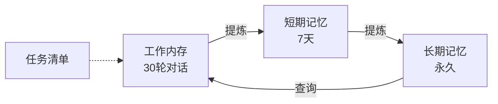
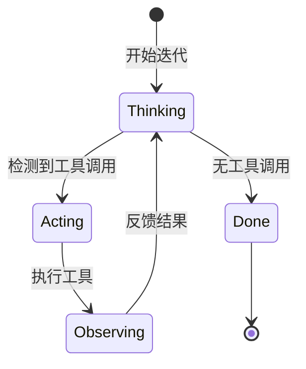

# Alice Agent 技术文档

> **⚠️ 免责声明**：本项目的所有代码均由 AI 生成。使用者在运行、部署或集成前，必须自行评估潜在的安全风险、逻辑缺陷及运行成本。作者不对因使用本项目而导致的任何损失负责。
>
> **💡 特别提示**：本项目包含特定的 **系统提示词分层文件 (`prompts/*.xml`)** 及 **运行时记忆记录 (`.alice/memory/`)**。相关文件会记录对话历史与运行时状态。如果您介意此类信息留存，请按需自行编辑或删除相关目录下的文件。

Alice 是一个基于 **ReAct 模式** 的智能体框架，采用 **DDD (领域驱动设计)** + **分层架构** + **依赖注入** 的设计模式。

---

## 效果展示


---

## 项目状态 / Project Status

Alice-Single 已完成从单文件入口到分层架构的重构；当前文档以 `docs/` 为统一入口，并持续随运行时配置、execution harness 与协议边界演进同步更新。

Alice-Single has completed the migration from a single-file entrypoint to a layered architecture. The `docs/` directory is now the canonical documentation entry and is kept in sync with runtime configuration, execution harness, and protocol boundary changes.

---

## 技术架构

### 整体架构

Alice 采用 **五层分层架构** + **Rust TUI 前端**：

```
┌─────────────────────────────────────────────────────────────┐
│  Frontend (Rust) ─── 用户界面、交互、渲染                   │
├─────────────────────────────────────────────────────────────┤
│  Infrastructure (Python) ─── Bridge、Docker、缓存          │
├─────────────────────────────────────────────────────────────┤
│  Application (Python) ─── 工作流、ReAct 循环、DTO           │
├─────────────────────────────────────────────────────────────┤
│  Domain (Python) ─── 内存、LLM、执行、技能核心逻辑          │
├─────────────────────────────────────────────────────────────┤
│  Core (Python) ─── DI 容器、事件总线、配置、接口            │
└─────────────────────────────────────────────────────────────┘
```

### 核心技术栈

| 层级 | 技术 | 职责 |
|------|------|------|
| **Frontend** | Rust (Ratatui) | 终端交互界面、实时渲染 |
| **Infrastructure** | Python | Bridge 通信、Docker 管理 |
| **Application** | Python | 工作流编排、ReAct 引擎 |
| **Domain** | Python | 业务逻辑、领域模型 |
| **Core** | Python | 横切关注点、基础设施 |

### 架构文档

- **[docs/README.md](docs/README.md)** - 文档总入口
- **[docs/architecture/overview.md](docs/architecture/overview.md)** - 架构总览
- **[docs/protocols/bridge.md](docs/protocols/bridge.md)** - Bridge 协议文档
- **[docs/reference/code-map.md](docs/reference/code-map.md)** - 代码地图总览
- **[CLAUDE.md](CLAUDE.md)** - 开发导航

---

## 交互快捷键 (TUI)

| 快捷键 | 动作 |
| :--- | :--- |
| **Enter** | 发送当前输入的消息 |
| **Esc** | **中断/停止** 当前正在进行的思考、回复或工具执行任务 |
| **Ctrl + O** | 切换显示/隐藏侧边栏（思考过程与代码区） |
| **Ctrl + C** | 强制退出程序 |
| **Up / Down** | 在对话历史中手动滚动（禁用自动滚动） |

---

## 部署与快速开始

### 环境依赖

#### 宿主机 (Host) 依赖
1. **Docker**: 必须安装并启动，用于提供单容器运行时
2. **Rust 编译环境**: 如需在宿主机运行 TUI，需要 Cargo 工具链

#### 容器 (Container) 依赖
- 自动通过 `Dockerfile.sandbox` 构建
- 默认是轻量运行容器，包含 Python、Node.js 和基础 shell 工具
- 当前默认执行模型是：agent 运行在该容器内，`run_bash` / `run_python` 通过 `container` harness 直接在容器内本地进程执行，而不是再嵌套 `docker exec`
- 输出目录固定映射到宿主机 `.alice/workspace`，容器内路径固定为 `/workspace`
- `.alice/` 会映射到容器内 `/app/.alice`
- `skills/` 会映射到容器内 `/app/skills`

### 部署步骤

1. **克隆项目**:
   ```bash
   git clone https://github.com/ArcaneOrion/Alice-Single.git
   cd Alice-Single
   ```

2. **构建轻量运行镜像**:
   ```bash
   docker build -t alice-runtime -f Dockerfile.sandbox .
   ```

3. **启动轻量运行容器**:
   ```bash
   mkdir -p .alice/workspace
   docker run --rm -it \
     -v "$(pwd)/.alice:/app/.alice" \
     -v "$(pwd)/skills:/app/skills" \
     -v "$(pwd)/.alice/workspace:/workspace" \
     alice-runtime
   ```

4. **如需在宿主机运行 TUI，再创建并激活 Python 虚拟环境**:
   ```bash
   python -m venv venv
   source venv/bin/activate  # Linux/macOS
   ```

5. **安装核心依赖**:
   ```bash
   pip install openai python-dotenv
   ```

6. **准备运行时配置**:
   ```bash
   ${EDITOR:-vi} .alice/config.json
   ```
   填入 `llm.api_key`、`llm.model_name`，按需设置 `llm.base_url`、`llm.provider_name` 等字段。
   如文件尚不存在，首次启动会自动补齐 `.alice/config.json`、`.alice/prompt/*.xml`、`.alice/prompt/prompt.xml` 与 `.alice/memory/*`。
   如果历史配置里的 `memory.prompt_path` 仍指向旧值 `.alice/prompt.xml`，启动会直接报错；当前唯一合法运行时 prompt 路径是 `.alice/prompt/prompt.xml`。

7. **启动 Alice**:
   ```bash
   cd frontend && cargo run --release
   ```

---

## 内置指令参考

这些指令由宿主机引擎直接拦截并执行：

| 指令 | 描述 |
| :--- | :--- |
| `toolkit list/refresh` | 管理技能注册表 |
| `memory "内容" [--ltm]` | 手动更新记忆 |
| `update_prompt 01_identity.xml "新内容"` | 更新 `.alice/prompt/` 下的提示词分片，并重建运行时 `.alice/prompt/prompt.xml` |
| `todo "任务清单"` | 更新任务追踪 |

---

## 项目结构

```
.
├── frontend/                       # Rust TUI 前端
│   ├── src/                        # TUI 源代码
│   └── Cargo.toml                  # 前端 Rust 项目配置
├── backend/alice/                  # Python 后端（分层架构）
│   ├── application/                # 应用层：workflow、agent、services、DTO
│   ├── domain/                     # 领域层：memory、llm、execution、skills
│   ├── infrastructure/             # 基础设施层：bridge、docker、gateway、cache、logging
│   ├── core/                       # 核心层：config、registry、interfaces 等
│   └── cli/                        # CLI / bridge 启动入口
├── backend/tests/                  # 后端测试
├── protocols/                      # 协议与 schema
├── docs/                           # 面向 agent 的结构化文档入口
├── Dockerfile.sandbox              # 沙盒镜像定义
├── prompts/                        # 分层 XML 系统提示词源码
├── skills/                         # 技能库
└── .alice/                         # 运行时配置、记忆、日志与 workspace
```

---

## 四层内存系统



| 内存类型 | 文件 | 保留策略 |
|----------|------|----------|
| 工作内存 | `.alice/memory/working_memory.md` | 最近 30 轮 |
| 短期记忆 (STM) | `.alice/memory/short_term_memory.md` | 7 天滚动 |
| 长期记忆 (LTM) | `.alice/memory/alice_memory.md` | 永久存储 |
| 任务清单 | `.alice/memory/todo.md` | 手动管理 |

## 系统提示词组织

系统提示词采用固定分层拼接模式，源文件位于 `prompts/`：

- `01_identity.xml`
- `02_principles.xml`
- `03_memory.xml`
- `04_tools.xml`
- `05_output.xml`

启动时，仓库里的这些模板会首次复制到 `.alice/prompt/` 下供用户编辑，并按固定顺序组装为运行时文件 `.alice/prompt/prompt.xml`。运行时实际读取的是 `.alice/prompt/prompt.xml`，日常编辑入口是 `.alice/prompt/*.xml`，而不是直接修改仓库里的 `prompts/` 模板。

---

## ReAct 循环流程



1. **Reasoning**: LLM 生成思考和响应
2. **Acting**: 检测并执行工具调用
3. **Observing**: 将执行结果反馈给 LLM
4. **重复**: 直到无工具调用或达到最大迭代次数

---

## 技能系统

技能从 `skills/` 目录自动发现，格式如下：

```yaml
---
name: skill-name          # 必需：技能名称
description: 技能描述     # 必需：功能说明
license: MIT             # 可选：许可证
allowed-tools: [...]     # 可选：允许使用的工具
---
# Markdown 内容...
```

**管理命令**:
- `toolkit list` - 列出所有技能
- `toolkit refresh` - 扫描新技能

---

## 通信协议

### Bridge 协议 (Rust <-> Python)

通过 stdin/stdout 传递 JSON Lines 消息：

```json
// Python -> Rust
{"type": "status", "content": "thinking"}
{"type": "thinking", "content": "正在分析..."}
{"type": "content", "content": "根据您的要求..."}
{"type": "tokens", "total": 1234, "prompt": 800, "completion": 434}
{"type": "error", "content": "API 调用失败", "code": "API_ERROR"}

// Rust -> Python
用户的输入内容
__INTERRUPT__  // 中断信号
```

---

## 许可证

项目遵循 MIT 开源协议。
